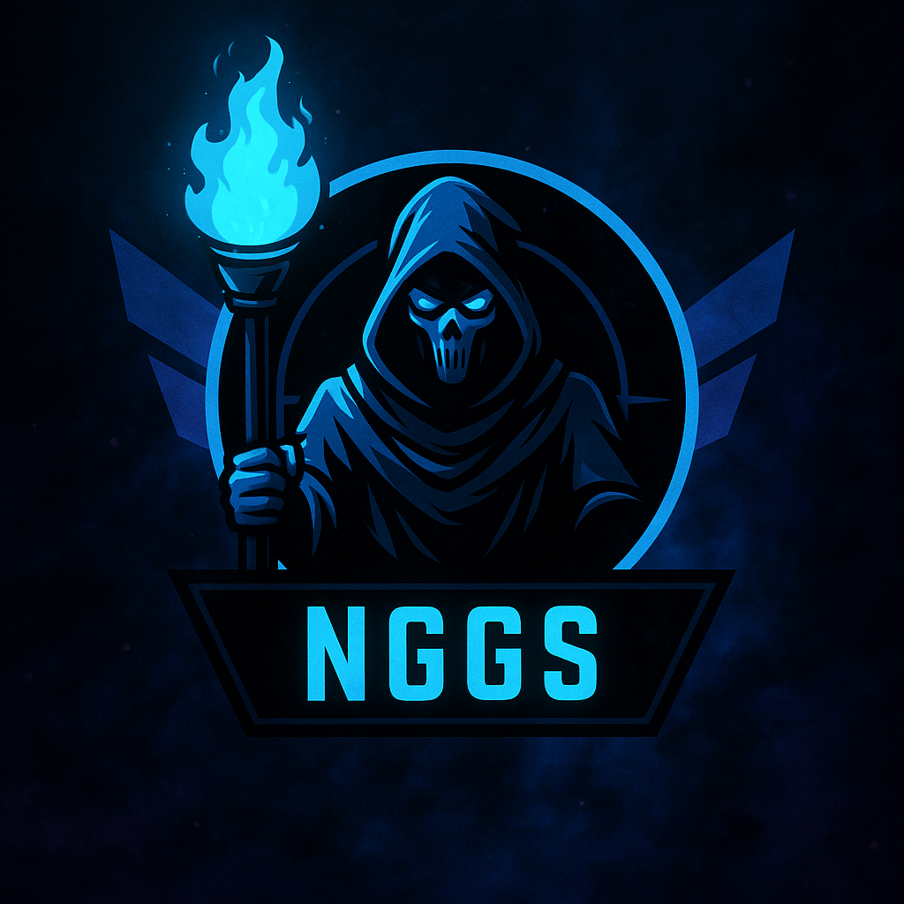

  

  

    
NGGS PLAY HUB

    <h1>Jogue leve, com setup afinado.</h1>
    

      Somos um squad de jogadores casuais que ama compartilhar ajustes simples para deixar o seu PC estável e o jogo mais divertido.
      Venha otimizar Windows, GPU e sensibilidade com orientações descomplicadas e sem papo de tryhard.
    

    

      <a class="md-button md-button--primary" href="comunidade/discord/">Entrar na comunidade</a>
      <a class="md-button md-button--ghost" href="#mapa-de-conteudo">Mapa de conteúdo</a>
    

  

  

    

      NGGS em ação
      

        <button type="button" class="nggs-carousel__control" data-carousel-prev aria-label="Vídeo anterior">
          ‹
        </button>
        <button type="button" class="nggs-carousel__control" data-carousel-next aria-label="Próximo vídeo">
          ›
        </button>
      

    

    

      <article class="nggs-carousel__slide" data-carousel-slide data-video-card data-video-id="gA1raXafp3Y">
        

          <iframe
            data-video-iframe
            src="https://www.youtube.com/embed/gA1raXafp3Y?enablejsapi=1&mute=1&controls=0&rel=0&modestbranding=1&playsinline=1"
            title="Setup NGGS para FPS estável"
            allow="accelerometer; autoplay; clipboard-write; encrypted-media; gyroscope; picture-in-picture; web-share"
            allowfullscreen
          ></iframe>
        

        
Aprenda a deixar o FPS firme com ajustes rápidos, sem gambiarras ou trapaça.

      </article>
      <article class="nggs-carousel__slide" data-carousel-slide data-video-card data-video-id="6QaM18OVmlM">
        

          <iframe
            data-video-iframe
            src="https://www.youtube.com/embed/6QaM18OVmlM?enablejsapi=1&mute=1&controls=0&rel=0&modestbranding=1&playsinline=1"
            title="Mods NGGS e ajustes táticos"
            allow="accelerometer; autoplay; clipboard-write; encrypted-media; gyroscope; picture-in-picture; web-share"
            allowfullscreen
          ></iframe>
        

        
Conheça mods e configs aprovadas para deixar a jogatina redonda com zero stress.

      </article>
      <article class="nggs-carousel__slide" data-carousel-slide data-video-card data-video-id="JtTVcViylV8">
        

          <iframe
            data-video-iframe
            src="https://www.youtube.com/embed/JtTVcViylV8?enablejsapi=1&mute=1&controls=0&rel=0&modestbranding=1&playsinline=1"
            title="Guias curados NGGS"
            allow="accelerometer; autoplay; clipboard-write; encrypted-media; gyroscope; picture-in-picture; web-share"
            allowfullscreen
          ></iframe>
        

        
Rotinas leves para curtir PUBG entre amigos com performance estável e zero estresse.

      </article>
    

  

  

    
  

<section class="nggs-section" id="mapa-de-conteudo">
  <header class="nggs-section__header">
    Mapa fácil
    <h2>Escolha o próximo ajuste sem dor de cabeça.</h2>
    
Parta das checklists, siga os passos com segurança e saiba como desfazer tudo se não curtir o resultado.

  </header>
  

    <article class="nggs-card">
      
      <h3>Preparar o PC</h3>
      
Checklist para deixar o PC redondo, Windows limpo, espaço livre e conexão sem travadinhas.

      <a href="pc/checklist/" class="nggs-card__link">Ver checklist</a>
    </article>
    <article class="nggs-card">
      
      <h3>GPU sem surpresas</h3>
      
Perfis NVIDIA e AMD para mais FPS sem exagero. Tudo dentro das recomendações oficiais.

      <a href="gpu/nvidia/" class="nggs-card__link">Abrir guias</a>
    </article>
    <article class="nggs-card">
      
      <h3>Precisão de mouse</h3>
      
Fundamentos, testes rápidos e nossa calculadora de eDPI para sentir o mouse do seu jeito.

      <a href="mouse/calculadora/" class="nggs-card__link">Calcular agora</a>
    </article>
    <article class="nggs-card">
      
      <h3>PUBG playbook</h3>
      
Dicas de loot, anexos e ideias de rotação para brincar em equipe sem virar treino profissional.

      <a href="pubg/guia-geral/" class="nggs-card__link">Montar estratégia</a>
    </article>
  

</section>

<section class="nggs-section nggs-section--accent">
  

    

      Suporte NGGS
      <h2>Conte com a nossa equipe para curtir PUBG sem dor de cabeça.</h2>
      

        Se o FPS caiu, o som bugou ou a mira não encaixa, chama a gente no Discord. Ajudamos a ajustar drivers, periféricos e
        até revisar vídeos de gameplay para apontar caminhos simples para melhorar.
      

      

        
<strong>Como funciona?</strong>

        <ul>
          <li>Chame nosso time pelo Discord e conte qual problema está travando suas partidas.</li>
          <li>Receba um plano de ajustes com passo a passo claro e opções de reversão se não gostar.</li>
          <li>Quando quiser, marque outra sessão para tirar dúvidas, revisar clipes ou experimentar configs novas.</li>
        </ul>
        <a class="md-button md-button--primary" href="comunidade/discord/">Quero orientação agora</a>
      

    

    

      
      

        Nosso suporte é direto ao ponto: configuração legítima, reversão documentada e muita paciência para explicar cada etapa.
        Você recebe dicas práticas, checkpoints de reversão e acompanhamento amigo da galera NGGS.
      

    

  

</section>

<section class="nggs-section">
  <header class="nggs-section__header">
    Respeito às regras
    <h2>Jogamos limpo porque é mais divertido assim.</h2>
    

      Tudo o que indicamos segue os termos de uso de PUBG, Microsoft, AMD e NVIDIA. Nada de atalhos duvidosos: preferimos
      jogatinas honestas, risada no lobby e evolução constante.
    

  </header>
  

    <article>
      <h3>Zero cheat</h3>
      
Sem no-recoil, macros ou automações. Curta o progresso real, reporte qualquer coisa suspeita e mantenha o servidor saudável.

    </article>
    <article>
      <h3>Documentação reversível</h3>
      
Cada etapa mostra como desfazer o ajuste. Segurança total para experimentar, aprender e voltar atrás se não curtir.

    </article>
    <article>
      <h3>Referências oficiais</h3>
      
Fontes da Microsoft, NVIDIA, AMD, Intel, Krafton e parceiros confiáveis. Nada de gambiarras, só soluções aprovadas.

    </article>
  

</section>
